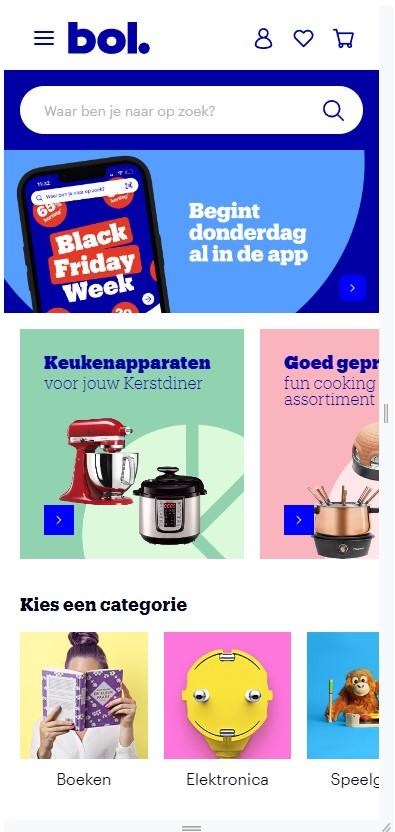
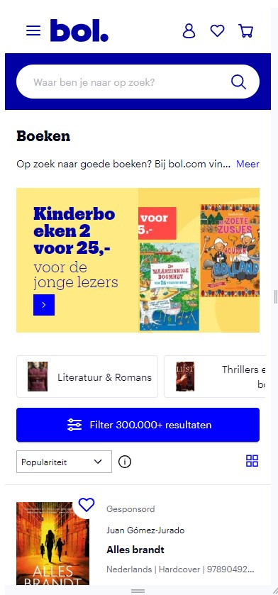
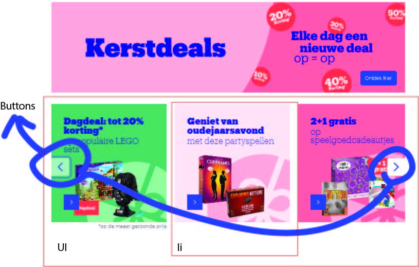

# Procesverslag
Markdown is een simpele manier om HTML te schrijven.  
Markdown cheat cheet: [Hulp bij het schrijven van Markdown](https://github.com/adam-p/markdown-here/wiki/Markdown-Cheatsheet).

Nb. De standaardstructuur en de spartaanse opmaak van de README.md zijn helemaal prima. Het gaat om de inhoud van je procesverslag. Besteedt de tijd voor pracht en praal aan je website.

Nb. Door *open* toe te voegen aan een *details* element kun je deze standaard open zetten. Fijn om dat steeds voor de relevante stuk(ken) te doen.

## Jij

  
uitwerken voor kick-off werkgroep

  ### Auteur:
  Tico Ligthart

  #### Je startniveau:
  Blauw start niveau

  #### Je focus:
  responsive
 

## Je website

  
uitwerken voor kick-off werkgroep

  ### Je opdracht:
  Bol.com 
  https://www.bol.com/nl/nl/

  #### Screenshot(s) van de eerste pagina (small screen): 
  Bol home page 
  

  #### Screenshot(s) van de tweede pagina (small screen):
  Bol boeken page 
  
 

## Toegankelijkheidstest 1/2 (week 1)

  
uitwerken na test in 2e werkgroep

  ### Bevindingen
  Lijst met je bevindingen die in de test naar voren kwamen:
  1. Niet elke button/link is goed omschreven. De meeste buttons en links hebben wel een goede naam, maar sommige heten gewoon "button" of "link".
  2. Html elementen zoals h1 etc zijn allemaal netjes toegepast.
  3. Veel is wel in orde, maar de Images zijn helemaal niet accesible. Ze zijn niet eens selecteerbaar, laat staan dat ze omschreven worden of dat je er op kan klikken.
     Terwijl sommige images geen tekst er onder hebben.

## Breakdownschets (week 1)

  
uitwerken na afloop 3e werkgroep

  ### de hele pagina: 
  

  ### dynamisch deel (Menu): 
  

  ### wellicht nog een dynamisch deel (Carousel): 
  

## Voortgang 1 (week 2)

  
uitwerken voor 1e voortgang

  ### Stand van zaken
  dit ging goed: Ik merk dat ik door de lessen en opdrachten css wel beter begrijp. Mijn header is nog niet zoals op de site, maar wel al een beetje responsive.
  
  dit was lastig: Ik merk dat ik html eigenlijk best wel verleerd ben. Ik had bijvoorbeeld geen main en had de header buiten het body element staan.
   

  ### Agenda voor meeting
  samen met je groepje opstellen

  | Tico           | Aidan              | Yusuf        |                  |
  | ---            | ---                | ---          | ---              |
  | Html netjes?   | Html               | Html         |                  |
  | Css beter?     | dit als er tijd is | nog een punt |                  |
  | ...            | ...                | ...          | ...              |

  ### Verslag van meeting
  hier na afloop snel de uitkomsten van de meeting vastleggen

  - Ik heb uitleg gekregen over hoe ik mijn header verbeter en meer zoals die van Bol.com maak
  - Ik heb mijn html verbeterd met wat simpele dingen die ik vergeten was zoals de header in de body zetten.
  - Ik heb geleerd hoe je h2 elementen nou goed gebruikt en hoe je elementen semantisch correct onzichtbaar maakt.

## Voortgang 2 (week 3)

  
uitwerken voor 2e voortgang

  ### Stand van zaken
  Goed:  ik heb geleerd mediaquery te gebruiken en dit toegepast.
  
  

  Lastig: Ik heb niet super veel voortgang gemaakt deze week. Ik zit erg vast bij dingen die niet goed willen lukken.

  ### Agenda voor meeting
  samen met je groepje opstellen

 Tico
    1.Css img responsiveness
    2.Css carousel

  Aidan
    1. 

  Yusuf
    1.

  ### Verslag van meeting
  hier na afloop snel de uitkomsten van de meeting vastleggen

  - Ik heb een rare bug samen met Sanne opgelost waardoor het Bol.com plaatje in mn h1 
    veel te veel ruimte in nam. We zijn er niet achter waardoor het nou kwam.
  - Ik heb een link doorgestuurd gekregen over hoe je carousels nou precies moet maken.

## Toegankelijkheidstest 2/2 (week 4)

  
uitwerken na test in 9e werkgroep

  ### Bevindingen
 - Mijn h1 wordt door de narrator niet opgelezen.
 - Mijn focus state is beter zichtbaar dan op bol.com. Ook worden verschillende elementen
  op de echte site heel klein als het scherm groter wordt, dit is bij mij niet zo.
 - Naast de h1 kan de narrator nog bij meer dingen niet, snap niet helemaal waarom niet.
 - Ondanks dat mn html op "nl" ingesteld staat leest mijn narrator het in het engels voor. De aria-labels werken wel goed.

## Voortgang 3 (week 4)

  
uitwerken voor 3e voortgang

  ### Stand van zaken
  Ik heb met behulp van de student assistent pijltjes toets knoppen gemaakt. Met javascript hebben we het zo gemaakt dat je de aanbiedingen ook daadwerkelijk kan laten bewegen. Ik heb dit hierna zelf ook nog een keer toegepast bij de " Kies categorie " sectie.  .

  Wat lastiger was is dat als ik de grootte van de site aanpas dit trucje niet zo goed meer werkt, omdat we gebruik maken van de translate waarde om de fotos te verplaatsen. Bijvoorbeeld translate 60% is een heel andere afstand op een groter scherm dan op het kleinere scherm. Op dit plaatje zie je wat er gebeurt als het scherm te groot wordt en je de pijltjes-buttons gebruikt.
  

  ### Agenda voor meeting
  samen met je groepje opstellen

Tico
1. De footer van mijn site maken
2. Alle kopjes laten oplezen door de narrator
3. Mn carousels doen het nog niet goed

Aidan
1.

Yusuf
1.

Ruby
1. Hoe zet ik lijntjes onder de items in mn nav
2. Hoe pas ik de pijltjes van summary en detail aan.

  ### Verslag van meeting
  hier na afloop snel de uitkomsten van de meeting vastleggen

  - Ik heb uitleg over summaries en details gehad. Ook heb ik hier een link over gehad.
  - Ik heb uitleg gekregen over hoe je met javascript dingen op basis van de viewWidth kan laten veranderen.

## Eindgesprek (week 5)

  
uitwerken voor eindgesprek

  ### Je uitkomst - karakteristiek screenshots:
  
  
  De header / site ziet er erg anders uit gebaseerd op screen width!

  ### Dit ging goed/Heb ik geleerd: 
 Ik heb erg veel over code geleerd dit blok, aangezien ik alles eigenlijk weer een beetje vergeten was. Als het lukt is het eigenlijk wel leuk. Ik heb vooral geleerd over flexbox en grid goed gebruiken, zodat je site op elke grootte er een beetje oke uitziet. Ook heb ik veel geleerd over dingen met javascript laten veranderen gebaseerd op classes en view width.

  
  
Hier zie je dat het zelfde stukje veel meer buttons en elementen heeft gebaseerd op
hoe breed het scherm is.

  ### Dit was lastig/Is niet gelukt:
   De 2e pagina is nog niet echt af. Ook zijn er verschillende dingen die nog niet goed werken, zoals deze buttons. Op klein scherm werken ze prima, maar omdat ze absolute zijn bewegen ze niet goed mee en zijn ze dus niet goed responsive.

  
  
 

## Bronnenlijst

  
continu bijhouden terwijl je werkt

  Nb. Wees specifiek ('css-tricks' als bron is bijv. niet specifiek genoeg). 
  Nb. ChatGpT en andere AI horen er ook bij.
  Nb. Vermeld de bronnen ook in je code.

  1. ChatGpt voor Javascript errors fixen
  2. https://www.a11yproject.com/posts/how-to-hide-content om kopjes hidden te maken maar wel leesbaar voor de narrator.
  3.  Frank van der Velde, een vriend van me die in ICT werkt, carousels op mijn site te verbeteren en responsive te maken.

